# 一起拉屎

一款记录生活习惯、分享快乐时光的应用

## 项目简介

本应用旨在帮助用户记录日常生活习惯，提供数据分析与统计功能，支持成就徽章系统以及好友互动与竞争功能。通过简洁直观的界面，用户可以轻松记录每日活动，追踪个人习惯养成进度，并与好友共同成长。
本程序使用uni-app框架Vue.js编写

## 版本信息

当前版本：Alpha0.0.1

## 功能特点

- 📝 记录每日生活习惯
- 📊 数据分析与统计
- 🏆 成就徽章系统
- 👥 好友互动与竞争

## 页面展示

### 首页

首页展示用户的今日健康提示、状态统计和好友动态，为用户提供日常习惯养成的概览。

### 记录
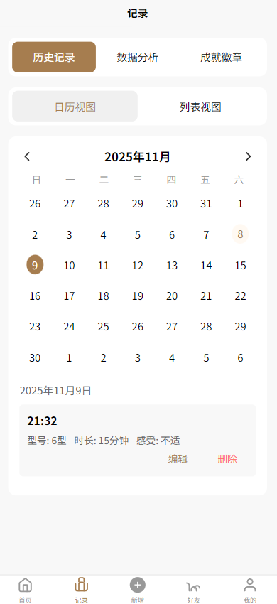

记录页面允许用户快速添加和查看详细的生活习惯记录，支持多种记录类型和数据输入。

### 新增
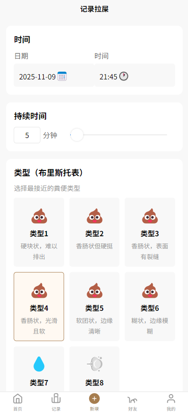

新增页面提供直观的表单界面，让用户轻松添加新的生活习惯记录，包含多种输入选项和快捷操作。

### 数据分析
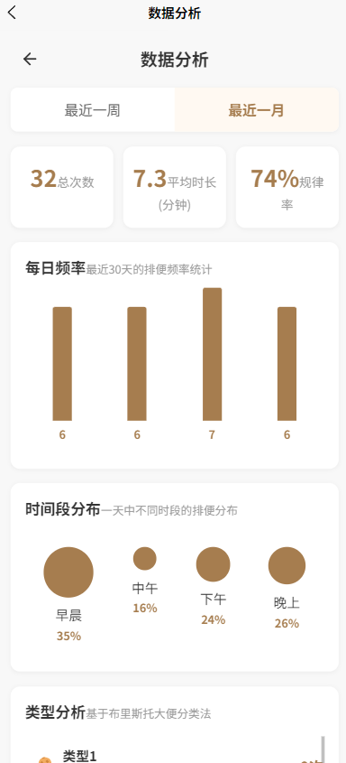

数据分析页面通过图表和统计数据，直观展示用户的习惯养成趋势和健康状况，帮助用户了解自己的进步。

### 比拼
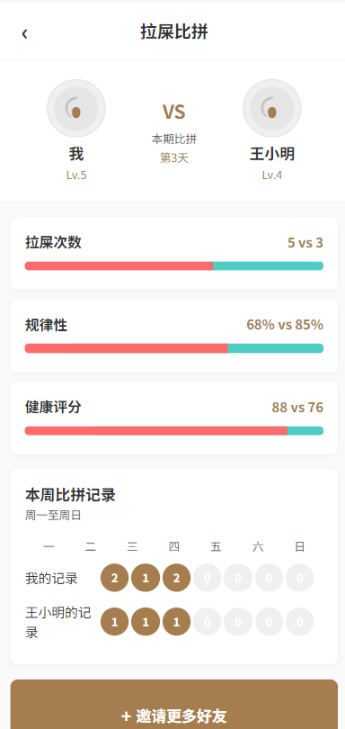

比拼页面展示用户与好友之间的习惯养成进度对比，增加应用的社交互动性和竞争激励。

### 好友
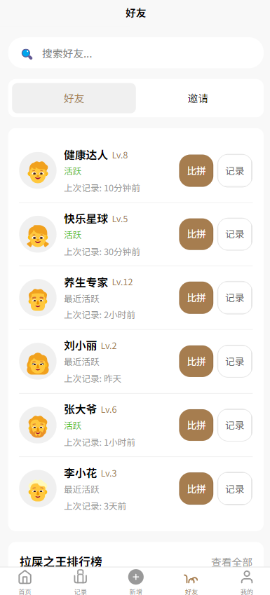

好友页面管理用户的社交网络，支持查看好友动态、添加新好友和进行互动交流。

### 我的
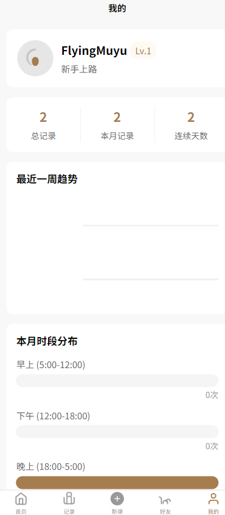

我的页面展示用户个人信息和设置入口，提供个人资料管理和应用功能导航。

### 用户中心
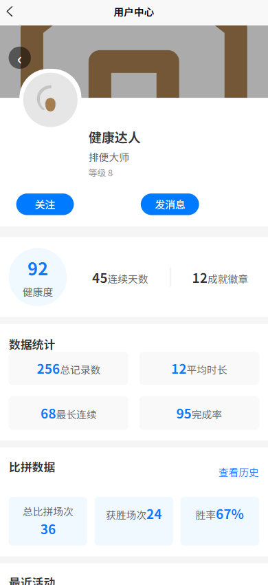

用户中心页面提供详细的个人资料编辑、账号设置和隐私管理功能。

### 成就勋章
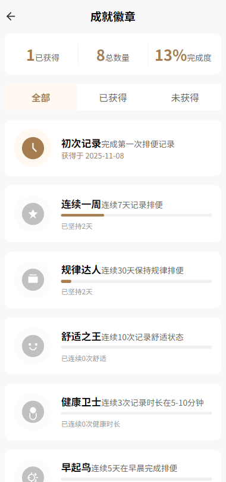

成就勋章页面展示用户获得的成就和徽章，通过游戏化元素激励用户坚持良好习惯。

### 历史记录
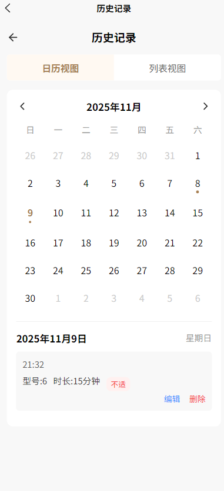

历史记录页面提供用户所有过去记录的完整存档，支持按时间、类型等多种方式查找和筛选。

### 设置
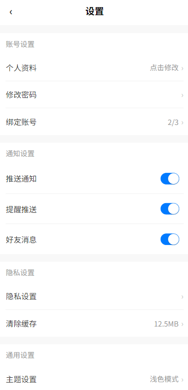

设置页面允许用户自定义应用行为、通知偏好、数据同步选项等各项配置。

### 关于我们
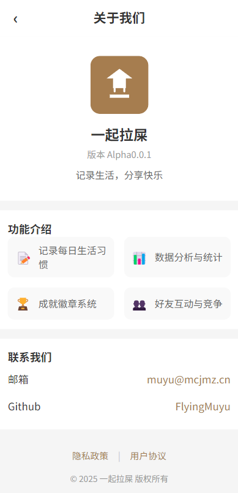

关于我们页面展示应用的版本信息、许可协议、开发团队信息和联系方式。

## 许可协议

⚠️ **重要声明：本软件禁止商业使用** ⚠️

本项目采用自定义的非商业使用许可协议。您可以查看完整的[LICENSE](LICENSE)文件了解详细条款。

核心许可条款：
- 允许非商业用途的使用、复制和修改
- 禁止任何商业目的的使用、分发或销售
- 使用时必须保留版权声明和许可证信息
- 修改版本必须明确标记为修改版

## 开发信息

开发团队：FlyingMuyu

## 联系方式

- 邮箱：muyu@mcjmz.cn
- GitHub：FlyingMuyu
